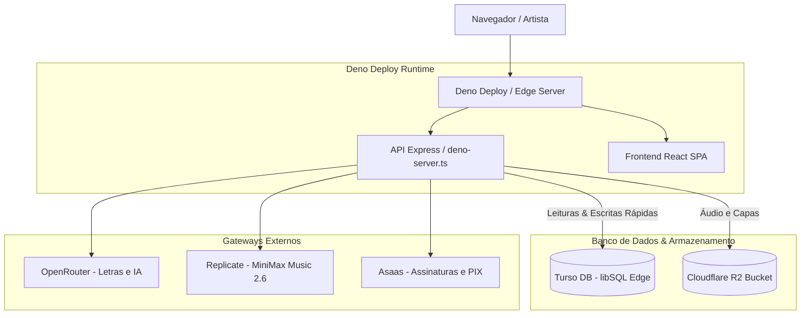

# ⚡ Guia de Migração para Turso DB (libSQL / SQLite na Edge)

Este documento orienta o processo de migração do banco de dados do **Portal do Artista** do **PostgreSQL** para o **Turso DB** (baseado em **libSQL**, fork de código aberto do SQLite otimizado para a Edge).

O projeto já está **100% preparado e adaptado** para operar com o Turso DB ou PostgreSQL de forma intercambiável.

---

## 🌟 Por que o Turso DB é Ideal para o Portal do Artista?

1. **Latência de Milissegundos no Brasil**:
   O Turso suporta instâncias primárias e réplicas na região de São Paulo (`gru`), garantindo leituras com menos de 10ms de tempo de resposta para usuários no Brasil.
2. **Casamento Perfeito com o Deno Deploy**:
   Tanto o Turso quanto o Deno Deploy rodam na Edge. A comunicação ocorre via HTTP/WebSockets (`@libsql/client/web`), sem a sobrecarga de conexão persistente de pools TCP convencionais.
3. **Custo Zero em Repouso**:
   O plano gratuito do Turso inclui até 500 bancos de dados, 9 GB de armazenamento total e 1 bilhão de leituras mensais, tornando-o extremamente econômico para escalar.
4. **Transações Rápidas e Simplicidade Operacional**:
   Sem necessidade de gerenciar instâncias de servidores complexos, backups pesados ou configurações de vCPU.

---

## 🏗️ Arquitetura Integrada



---

## 🚀 Passo a Passo para Migrar

### 1. Instalar o Turso CLI

- **Windows (PowerShell)**:
  ```powershell
  irm https://get.tur.so/install.ps1 | iex
  ```
  *ou via Scoop:*
  ```powershell
  scoop bucket add turso https://github.com/tursodatabase/scoop-bucket
  scoop install turso
  ```

- **Linux / macOS**:
  ```bash
  curl -sSfL https://get.tur.so/install.sh | bash
  ```

---

### 2. Autenticar na sua Conta Turso

```bash
turso auth signup
# ou, se já possui conta:
turso auth login
```

---

### 3. Criar o Banco de Dados em São Paulo (`gru`)

Execute o comando abaixo para provisionar o banco na região do Brasil:

```bash
turso db create portal-do-artista --location gru
```

---

### 4. Obter a URL de Conexão e o Token de Acesso

1. **Obter a URL do banco:**
   ```bash
   turso db show portal-do-artista --url
   ```
   *Exemplo de saída:* `libsql://portal-do-artista-seuuser.turso.io`

2. **Gerar o Token de Acesso permanente:**
   ```bash
   turso db tokens create portal-do-artista
   ```
   *Guarde o token JWT retornado.*

---

### 5. Executar a Migração Automatizada de Dados

O projeto conta com um script automatizado que lê todo o banco PostgreSQL atual, cria a estrutura de tabelas no Turso e migra todos os registros mantendo a integridade:

#### Opção A (Configurando o `.env`):
No seu arquivo `.env`, adicione:
```env
TURSO_DATABASE_URL=libsql://portal-do-artista-seuuser.turso.io
TURSO_AUTH_TOKEN=seu-token-jwt-gerado
```

E execute:
```bash
pnpm run db:migrate:turso
# ou utilizando Deno:
deno task migrate:turso
```

#### Opção B (Passando Parâmetros via Linha de Comando):
```bash
pnpm run db:migrate:turso -- --url libsql://portal-do-artista-seuuser.turso.io --token seu-token-jwt
```

O script exibirá o progresso tabela por tabela e gerará uma tabela final de conferência:
```text
===============================================================
🚀 PORTAL DO ARTISTA - MIGRAÇÃO PARA TURSO DB (libSQL / SQLite)
===============================================================

📡 Origem (PostgreSQL): postgres://******@host:5432/db
⚡ Destino (Turso DB):   libsql://portal-do-artista-seuuser.turso.io
---------------------------------------------------------------

⏳ Testando conexão com Turso DB...
✅ Conexão com Turso DB estabelecida com sucesso!

📦 Aplicando DDL e criando tabelas no Turso DB...
✅ Estrutura de tabelas e índices criada no Turso DB!

🔄 Iniciando migração de dados tabela por tabela...
   ✅ OK [artists] PG: 42 | Turso: 42
   ✅ OK [songs] PG: 180 | Turso: 180
   ✅ OK [plans] PG: 5 | Turso: 5
   ...
===============================================================
📊 RELATÓRIO FINAL DA MIGRAÇÃO
===============================================================
🎉 Migração para Turso DB concluída com sucesso!
```

---

## 🔑 Variáveis de Ambiente em Produção (Deno Deploy / VPS)

Para ativar o Turso DB em produção (por exemplo, no painel do **Deno Deploy** em *Settings → Environment Variables*):

| Variável | Descrição | Exemplo |
|---|---|---|
| `TURSO_DATABASE_URL` | URL de conexão libSQL | `libsql://portal-do-artista-seuuser.turso.io` |
| `TURSO_AUTH_TOKEN` | Token JWT de autenticação | `eyJh...` |

> [!TIP]
> Caso `TURSO_DATABASE_URL` esteja presente, o conector `lib/db` utilizará automaticamente a conexão ultra-rápida do Turso DB. Se quiser manter PostgreSQL temporariamente, basta manter `DATABASE_URL`.

---

## 🛠️ Comandos Úteis do Turso CLI

### Acessar o Shell Interativo (SQL direto no terminal):
```bash
turso db shell portal-do-artista
```
Exemplo de queries:
```sql
SELECT count(*) FROM artists;
SELECT titulo, genero, status FROM songs LIMIT 5;
```

### Criar Réplica de Leitura em Outro Continente:
Se tiver usuários nos EUA ou Europa e quiser leitura instantânea também lá:
```bash
turso db replicate portal-do-artista iad # Virgínia, EUA
turso db replicate portal-do-artista fra # Frankfurt, Europa
```

### Fazer Backup ou Dump do Banco:
```bash
turso db shell portal-do-artista .dump > backup-turso.sql
```

---

## 📋 Tabelas Cobertas na Migração

- `artists` (Perfis, senhas criptografadas, estilos de card, créditos de IA, personalização)
- `songs` (Catálogo de músicas, links de áudio R2, YouTube, VIP, métricas)
- `plans` (Planos Free, Básico, Intermediário, Pro, Premium)
- `subscriptions` (Assinaturas ativas no Asaas)
- `coupons` (Cupons de desconto)
- `ai_music_demos` (Gerações do Vivi Studio MiniMax Music 2.6)
- `interests` (Leads e solicitações de contratação de shows / liberação)
- `playlists` e `playlist_songs`
- `galleries` e `gallery_photos`
- `genres` e `cities`
- `audicoes`, `song_likes`, `contatos`, `eventos`, `custos`, `receitas`
- `articles` e `article_categories` (Blog)
- `song_composers`, `cta_banners`, `exit_feedbacks`, `password_resets`, `ajuda`
- `sessions` (Sessões de login na Edge)
